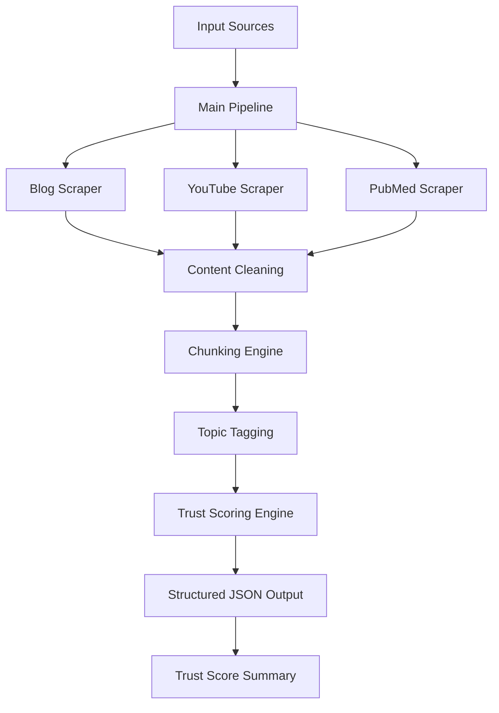
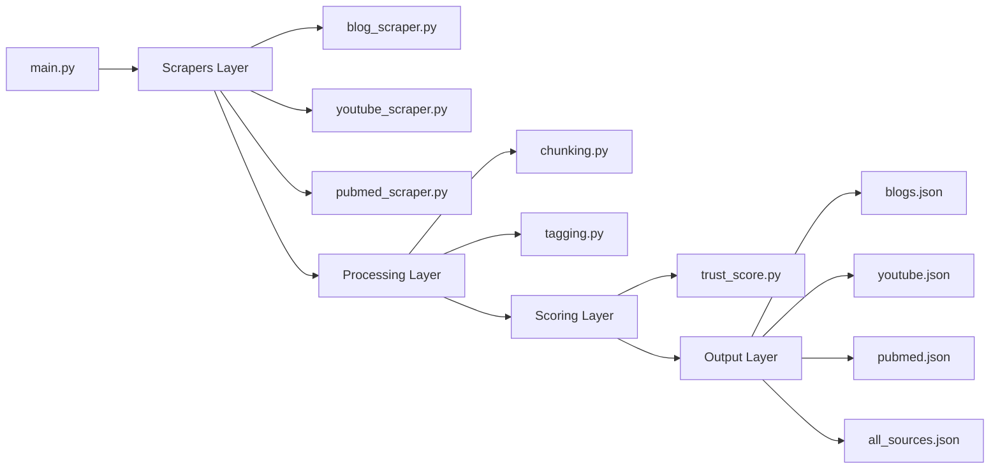
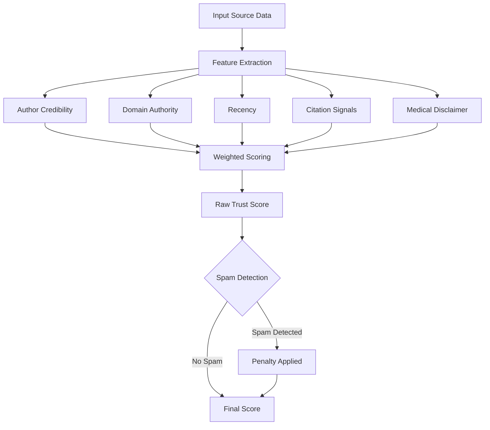
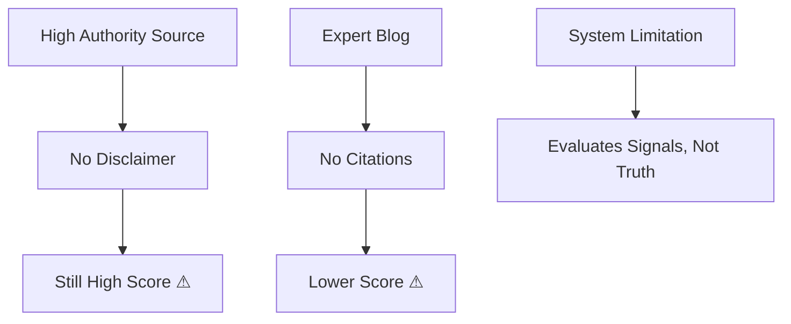

# 🧠 AI & Mental Health — Multi-Source Scraping + Trust Scoring System

---

## 🚀 Overview

In the domain of **AI in Mental Health**, information varies widely in credibility — from peer-reviewed research to influencer-driven content.

This project builds a **multi-source data pipeline** that:

* Scrapes structured content from blogs, YouTube, and PubMed
* Processes and standardizes heterogeneous data
* Assigns a **trust score (0–1)** using interpretable rules
* Highlights **why a source is reliable**, not just what it contains

> This is not just a scraper — it is a system that **reasons about information quality**.

---

## 🎯 Objective

* Collect data from **3 blogs, 2 YouTube videos, 1 PubMed paper**
* Extract metadata + content
* Apply **rule-based trust scoring**
* Produce structured JSON outputs
* Provide **transparent reasoning behind scores**

---

## 🏗️ System Architecture



---

## ⚙️ Pipeline Flow

```text
Collection → Cleaning → Structuring → Feature Extraction → Trust Scoring → Output
```

### Data Collection

* Blogs → `requests + BeautifulSoup`
* YouTube → `youtube-transcript-api` (with fallback)
* PubMed → `Biopython Entrez API`

### Processing

* Noise removal (HTML cleanup)
* Content normalization
* Structured JSON formatting

---

## 🧩 Component Design



---

## 🧠 Trust Scoring System

### Formula

```text
Trust Score =
  0.30 × Author Credibility
+ 0.25 × Domain Authority
+ 0.20 × Recency
+ 0.15 × Citation Strength
+ 0.10 × Medical Disclaimer
```

---

## 🔍 Scoring Logic Flow



---

## 📊 Trust Score Results

### Ranked Output Table

| Rank | Source Title | Type | Score | Language | Spam |
|------|-------------|------|-------|----------|------|
| 🥇 1 | The therapeutic effectiveness... | PubMed | **0.860** | en | ✅ No |
| 🥈 2 | AI-Mental Health Is Coming... | Blog | **0.755** | en | ✅ No |
| 🥉 3 | The AI therapist will see you now... | Blog | **0.754** | en | ✅ No |
| 4 | AI and the Future of Mental Health... | YouTube | **0.585** | en | ✅ No |
| 5 | Can AI help with mental health? | Blog | **0.546** | en | ✅ No |
| 6 | Can AI Really Help With Mental Health | YouTube | **0.445** | en | ✅ No |

---

### 📈 Trust Score Visualization

```
PubMed  ████████████████████████████████████████████  0.86
Blog    ███████████████████████████████████████       0.755
Blog    ███████████████████████████████████████       0.754
YouTube █████████████████████████████                 0.585
Blog    ████████████████████████████                  0.546
YouTube ██████████████████████                        0.445
        0.0        0.2        0.4        0.6        0.8       1.0
```

> Generate and embed the chart image by running:

```python
import matplotlib.pyplot as plt

sources = [
    "Can AI Really Help\n(YouTube)",
    "Can AI help with\nmental health? (Blog)",
    "AI and the Future\n(YouTube)",
    "The AI therapist\nwill see you now (Blog)",
    "AI Mental Health\nIs Coming (Blog)",
    "Therapeutic\nEffectiveness (PubMed)",
]
scores = [0.445, 0.546, 0.585, 0.754, 0.755, 0.860]
colors = ["#e74c3c", "#e67e22", "#f1c40f", "#2ecc71", "#27ae60", "#1abc9c"]

plt.figure(figsize=(10, 5))
bars = plt.barh(sources, scores, color=colors)
for bar, score in zip(bars, scores):
    plt.text(score + 0.01, bar.get_y() + bar.get_height() / 2,
             str(score), va="center", fontsize=10)
plt.xlabel("Trust Score (0 = Least Reliable, 1 = Most Reliable)")
plt.title("Trust Score Ranking — AI in Mental Health Sources")
plt.xlim(0, 1.05)
plt.tight_layout()
plt.savefig("output/trust_scores.png", bbox_inches="tight")
plt.show()
```

```markdown

```

---

## 📌 Key Insights

* **PubMed ranks highest** due to:
  * Peer review process
  * Multiple credentialed authors
  * Structured citations and DOI

* **Blogs fall into mid-tier (~0.75)**:
  * Credible authors (Ph.D. level) but less rigorous than journals
  * Psychology Today and The Conversation score similarly

* **YouTube ranks lower**:
  * Weak citation signals
  * Informal content structure
  * Stanford CME significantly outscores Psych2Go

> The system produces a **gradient of trust**, not a binary classification.

---

## 🛡️ Abuse Prevention Logic

### Handles:

* **Fake authors**
  * Regex detection of patterns like `admin`, `user123`

* **SEO spam**
  * Detects phrases like `"click here"`, `"miracle cure"`

* **Missing disclaimers**
  * Penalizes medical advice without proper caution language

* **Low authority domains**
  * Default penalty applied for unknown or unlisted domains

---

## ⚠️ Limitations

* Cannot verify **truth**, only **credibility signals**
* Keyword-based citation detection is an approximation, not true reference counting
* No semantic understanding of content quality
* YouTube transcripts unavailable — fallback to manual descriptions used
* Domain authority is heuristic-based (curated whitelist)

---

## 🚨 Where This System Fails



---

## 📦 Dataset

| Source Type | Count |
|-------------|-------|
| Blogs | 3 |
| YouTube | 2 |
| PubMed | 1 |
| **Total** | **6 (intentionally diverse)** |

---

## 📁 Project Structure

```
Assignment/
├── scraper/
│   ├── blog_scraper.py
│   ├── youtube_scraper.py
│   └── pubmed_scraper.py
├── scoring/
│   └── trust_score.py
├── utils/
│   ├── tagging.py
│   └── chunking.py
├── output/
│   ├── blogs.json
│   ├── youtube.json
│   ├── pubmed.json
│   └── all_sources.json
├── main.py
└── README.md
```

---

## ▶️ How to Run

```bash
# Install dependencies
pip install requests beautifulsoup4 youtube-transcript-api biopython scikit-learn

# Run full pipeline
python main.py
```

---

## 📤 Output Files

```
output/
├── blogs.json
├── youtube.json
├── pubmed.json
└── all_sources.json
```

---

## 🧠 Design Philosophy

This system intentionally prioritizes:

* **Interpretability over complexity**
* **Structured reasoning over ML black boxes**
* **Clear assumptions over hidden heuristics**

---

## 🏁 Final Takeaway

> Credibility is multi-dimensional — not binary.

A source is not simply "true" or "false".  
It exists on a spectrum shaped by:

* Authorship
* Domain
* Recency
* Evidence

This project models that spectrum in a **transparent and explainable way**.

---

## 👤 Author

**Pragati Mohan**  
AI / Systems Thinking / Research-Oriented Engineering