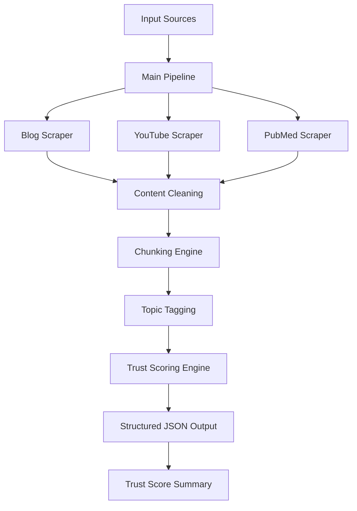
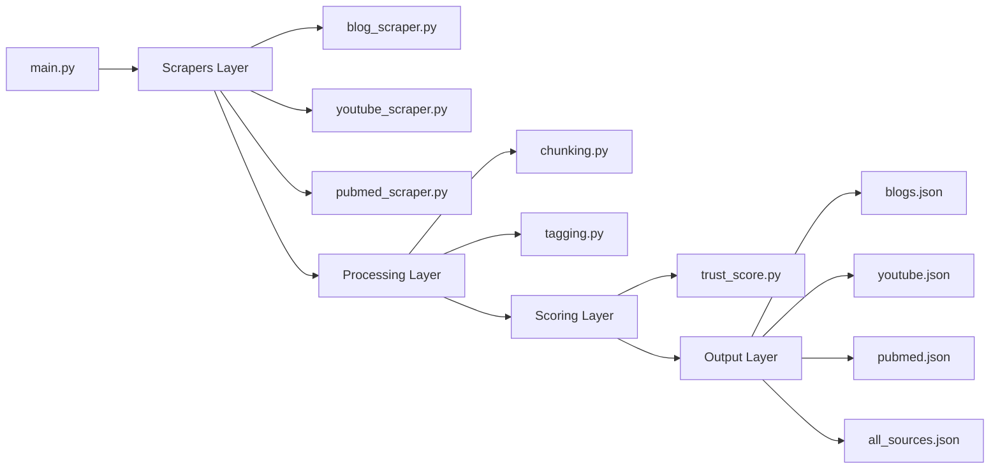
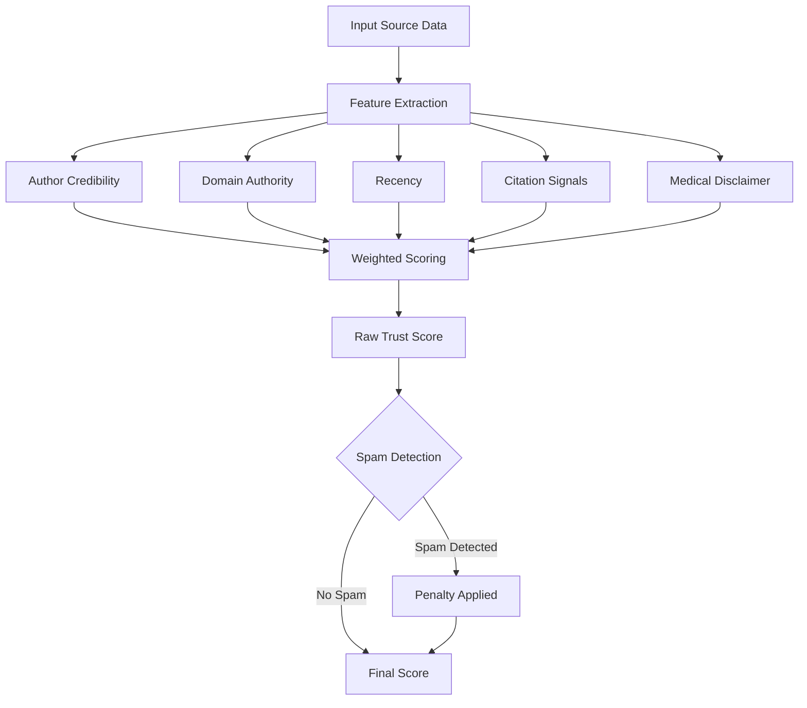
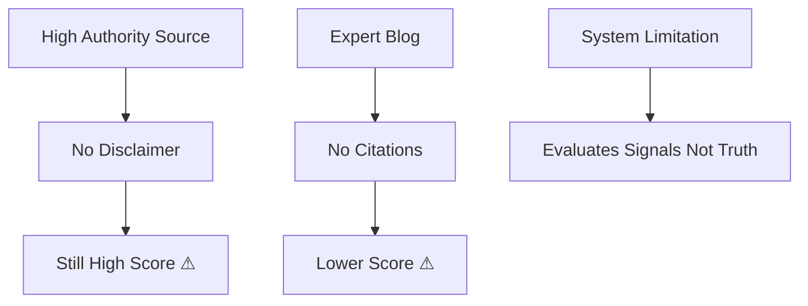

# 🧠 AI & Mental Health — Multi-Source Scraping + Trust Scoring System

---

## 🚀 Overview

In the domain of **AI in Mental Health**, information varies widely in credibility — from peer-reviewed research to influencer-driven content.

This project builds a **multi-source data pipeline** that:

* Scrapes structured content from blogs, YouTube, and PubMed
* Processes and standardizes heterogeneous data
* Assigns a **trust score (0–1)** using interpretable rules
* Highlights **why a source is reliable**, not just what it contains

> This is not just a scraper — it is a system that **reasons about information quality**.

---

## 🎯 Objective

* Collect data from **3 blogs, 2 YouTube videos, 1 PubMed paper**
* Extract metadata + content
* Apply **rule-based trust scoring**
* Produce structured JSON outputs
* Provide **transparent reasoning behind scores**

---

## 🏗️ System Architecture



---

## ⚙️ Pipeline Flow

```text
Collection → Cleaning → Structuring → Feature Extraction → Trust Scoring → Output
```

### Data Collection

* Blogs → `requests + BeautifulSoup`
* YouTube → `youtube-transcript-api` (with fallback)
* PubMed → `Biopython Entrez API`

### Processing

* Noise removal (HTML cleanup)
* Content normalization
* Structured JSON formatting

---

## 🧩 Component Design



---

## 🧠 Trust Scoring System

### Formula

```text
Trust Score =
  0.30 × Author Credibility
+ 0.25 × Domain Authority
+ 0.20 × Recency
+ 0.15 × Citation Strength
+ 0.10 × Medical Disclaimer
```

---

## 🔍 Scoring Logic Flow



---

## 📊 Trust Score Results

### Ranked Output Table

| Rank | Source Title | Type | Score | Language | Spam |
|------|-------------|------|-------|----------|------|
| 🥇 1 | The therapeutic effectiveness... | PubMed | **0.860** | en | ✅ No |
| 🥈 2 | AI-Mental Health Is Coming... | Blog | **0.755** | en | ✅ No |
| 🥉 3 | The AI therapist will see you now... | Blog | **0.754** | en | ✅ No |
| 4 | AI and the Future of Mental Health... | YouTube | **0.585** | en | ✅ No |
| 5 | Can AI help with mental health? | Blog | **0.546** | en | ✅ No |
| 6 | Can AI Really Help With Mental Health | YouTube | **0.445** | en | ✅ No |

---

### 📈 Trust Score Visualization

> The chart below is rendered as an SVG — no external files needed.

<svg xmlns="http://www.w3.org/2000/svg" viewBox="0 0 720 340" width="720" height="340" font-family="sans-serif" font-size="13">

  <!-- Background -->
  <rect width="720" height="340" fill="#1a1a2e" rx="10"/>

  <!-- Title -->
  <text x="360" y="32" text-anchor="middle" fill="#e0e0e0" font-size="15" font-weight="bold">Trust Score Ranking — AI in Mental Health Sources</text>

  <!-- X-axis labels -->
  <text x="160" y="310" text-anchor="middle" fill="#aaa" font-size="11">0.0</text>
  <text x="265" y="310" text-anchor="middle" fill="#aaa" font-size="11">0.2</text>
  <text x="370" y="310" text-anchor="middle" fill="#aaa" font-size="11">0.4</text>
  <text x="475" y="310" text-anchor="middle" fill="#aaa" font-size="11">0.6</text>
  <text x="580" y="310" text-anchor="middle" fill="#aaa" font-size="11">0.8</text>
  <text x="685" y="310" text-anchor="middle" fill="#aaa" font-size="11">1.0</text>

  <!-- Grid lines -->
  <line x1="160" y1="50" x2="160" y2="295" stroke="#333" stroke-width="1"/>
  <line x1="265" y1="50" x2="265" y2="295" stroke="#333" stroke-width="0.5" stroke-dasharray="4"/>
  <line x1="370" y1="50" x2="370" y2="295" stroke="#333" stroke-width="0.5" stroke-dasharray="4"/>
  <line x1="475" y1="50" x2="475" y2="295" stroke="#333" stroke-width="0.5" stroke-dasharray="4"/>
  <line x1="580" y1="50" x2="580" y2="295" stroke="#333" stroke-width="0.5" stroke-dasharray="4"/>
  <line x1="685" y1="50" x2="685" y2="295" stroke="#333" stroke-width="0.5" stroke-dasharray="4"/>

  <!-- Source labels (Y-axis) -->
  <text x="150" y="79" text-anchor="end" fill="#ccc" font-size="12">Therapeutic Effectiveness (PubMed)</text>
  <text x="150" y="119" text-anchor="end" fill="#ccc" font-size="12">AI Mental Health Is Coming (Blog)</text>
  <text x="150" y="159" text-anchor="end" fill="#ccc" font-size="12">The AI Therapist Will See You (Blog)</text>
  <text x="150" y="199" text-anchor="end" fill="#ccc" font-size="12">AI and the Future of MH (YouTube)</text>
  <text x="150" y="239" text-anchor="end" fill="#ccc" font-size="12">Can AI Help With Mental Health? (Blog)</text>
  <text x="150" y="279" text-anchor="end" fill="#ccc" font-size="12">Can AI Really Help With MH (YouTube)</text>

  <!-- Bars (scale: score * 525 + 160 for x end, bar height 22px) -->

  <!-- PubMed 0.860 -->
  <rect x="161" y="61" width="451" height="26" fill="#1abc9c" rx="3"/>
  <text x="618" y="79" fill="#1abc9c" font-size="12" font-weight="bold">0.860</text>

  <!-- Blog 0.755 -->
  <rect x="161" y="101" width="396" height="26" fill="#27ae60" rx="3"/>
  <text x="563" y="119" fill="#27ae60" font-size="12" font-weight="bold">0.755</text>

  <!-- Blog 0.754 -->
  <rect x="161" y="141" width="396" height="26" fill="#2ecc71" rx="3"/>
  <text x="563" y="159" fill="#2ecc71" font-size="12" font-weight="bold">0.754</text>

  <!-- YouTube 0.585 -->
  <rect x="161" y="181" width="307" height="26" fill="#f1c40f" rx="3"/>
  <text x="474" y="199" fill="#f1c40f" font-size="12" font-weight="bold">0.585</text>

  <!-- Blog 0.546 -->
  <rect x="161" y="221" width="287" height="26" fill="#e67e22" rx="3"/>
  <text x="454" y="239" fill="#e67e22" font-size="12" font-weight="bold">0.546</text>

  <!-- YouTube 0.445 -->
  <rect x="161" y="261" width="234" height="26" fill="#e74c3c" rx="3"/>
  <text x="401" y="279" fill="#e74c3c" font-size="12" font-weight="bold">0.445</text>

  <!-- X-axis line -->
  <line x1="160" y1="295" x2="700" y2="295" stroke="#555" stroke-width="1"/>

  <!-- X-axis title -->
  <text x="430" y="328" text-anchor="middle" fill="#888" font-size="11">Trust Score (0 = Least Reliable, 1 = Most Reliable)</text>
</svg>

---

## 📌 Key Insights

* **PubMed ranks highest** due to:
  * Peer review process
  * Multiple credentialed authors
  * Structured citations and DOI

* **Blogs fall into mid-tier (~0.75)**:
  * Credible authors (Ph.D. level) but less rigorous than journals
  * Psychology Today and The Conversation score similarly

* **YouTube ranks lower**:
  * Weak citation signals
  * Informal content structure
  * Stanford CME significantly outscores Psych2Go

> The system produces a **gradient of trust**, not a binary classification.

---

## 🛡️ Abuse Prevention Logic

### Handles:

* **Fake authors** — Regex detection of patterns like `admin`, `user123`
* **SEO spam** — Detects phrases like `"click here"`, `"miracle cure"`
* **Missing disclaimers** — Penalizes medical advice without proper caution language
* **Low authority domains** — Default penalty applied for unknown or unlisted domains

---

## ⚠️ Limitations

* Cannot verify **truth**, only **credibility signals**
* Keyword-based citation detection is an approximation, not true reference counting
* No semantic understanding of content quality
* YouTube transcripts unavailable — fallback to manual descriptions used
* Domain authority is heuristic-based (curated whitelist)

---

## 🚨 Where This System Fails



---

## 📦 Dataset

| Source Type | Count |
|-------------|-------|
| Blogs | 3 |
| YouTube | 2 |
| PubMed | 1 |
| **Total** | **6 (intentionally diverse)** |

---

## 📁 Project Structure

```
Assignment/
├── scraper/
│   ├── blog_scraper.py
│   ├── youtube_scraper.py
│   └── pubmed_scraper.py
├── scoring/
│   └── trust_score.py
├── utils/
│   ├── tagging.py
│   └── chunking.py
├── output/
│   ├── blogs.json
│   ├── youtube.json
│   ├── pubmed.json
│   └── all_sources.json
├── main.py
└── README.md
```

---

## ▶️ How to Run

```bash
# Install dependencies
pip install requests beautifulsoup4 youtube-transcript-api biopython scikit-learn

# Run full pipeline
python main.py
```

---

## 📤 Output Files

```
output/
├── blogs.json
├── youtube.json
├── pubmed.json
└── all_sources.json
```

---

## 🧠 Design Philosophy

This system intentionally prioritizes:

* **Interpretability over complexity**
* **Structured reasoning over ML black boxes**
* **Clear assumptions over hidden heuristics**

---

## 🏁 Final Takeaway

> Credibility is multi-dimensional — not binary.

A source is not simply "true" or "false".  
It exists on a spectrum shaped by:

* Authorship
* Domain
* Recency
* Evidence

This project models that spectrum in a **transparent and explainable way**.

---

## 👤 Author

**Pragati Mohan**  
AI / Systems Thinking / Research-Oriented Engineering